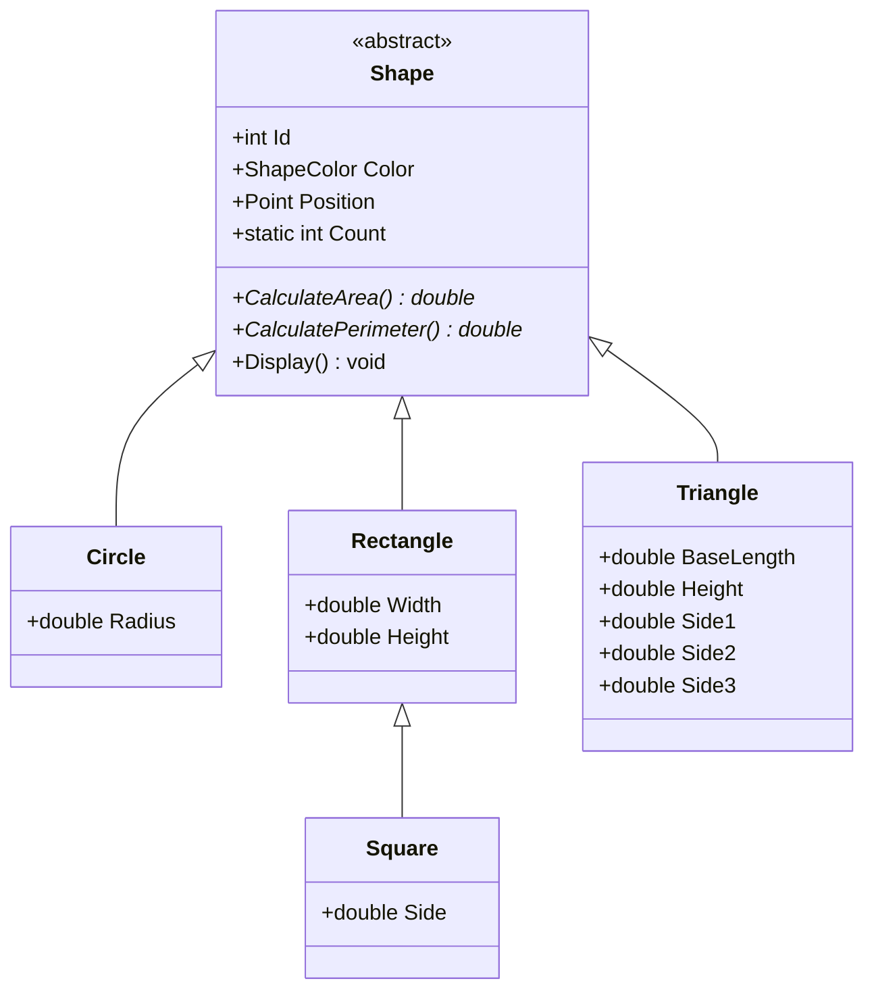

# 🧮 OOP Concepts — Solution README

الملف ده بيغطي جزئين من نفس الـ Solution:
1. **Fraction** (كسور) + **Student/Course** (طلبة وكورسات)
2. **Shape Hierarchy** (هرم الأشكال الهندسية)

## 📑 المحتويات
- [1. Fraction & Student/Course](#1-fraction--studentcourse)
- [2. Shape Hierarchy](#2-shape-hierarchy)

---

## 1. Fraction & Student/Course

### 🧩 الكود (استخدام)

```csharp
Fraction f1 = new Fraction(1, 2);
Fraction f2 = new Fraction(1, 3);
Console.WriteLine($"{f1} + {f2} = {f1 + f2}");
```

### 🔑 مفاهيم Fraction

#### Constructor (الباني)
```csharp
new Fraction(1, 2)
```
كل مرة بتعمل Object جديد، الـ Constructor بيهيّئ البيانات الأولية (البسط والمقام).

#### Operator Overloading (تحميل العمليات)
```csharp
f1 + f2
f3 - f4
f5 * f6
f7 / f8
```
الكلاس عامل Override للعمليات الحسابية العادية عشان تشتغل على الكسور زي الأرقام العادية. كل عمليات الجمع/الطرح/الضرب/القسمة والمقارنة **بتحول القسمة لضرب متبادل** (Cross Multiplication) بدل القسمة المباشرة، عشان تتجنب مشاكل الـ Rounding.

#### Overriding ToString()
```csharp
public override string ToString() => $"{Numerator}/{Denominator}";
```
لما تحط الـ Object جوه `$"{...}"`، بينادي تلقائيًا على `ToString()`.

#### تبسيط الكسر بالـ GCD (خوارزمية إقليدس)
```csharp
int gcd = Gcd(Math.Abs(numerator), Math.Abs(denominator));
Numerator = numerator / gcd;
Denominator = denominator / gcd;
```
جوه الـ Constructor، بيتحسب **القاسم المشترك الأكبر** بين البسط والمقام عشان يوصل لأبسط صورة للكسر تلقائيًا. `Gcd` نفسها method مساعدة `private` — مستخدمة جوه الكلاس بس.

#### Equality & Comparison مع Nullable
```csharp
public static bool operator ==(Fraction? a, Fraction? b)
{
    if (ReferenceEquals(a, b)) return true;
    if (a is null || b is null) return false;
    return a.Numerator == b.Numerator && a.Denominator == b.Denominator;
}
public static bool operator !=(Fraction? a, Fraction? b) => !(a == b);
```
`Fraction?` بتخلي المقارنة تشتغل حتى لو أحد الكسرين `null` من غير كراش.

#### Exception Handling
```csharp
if (denominator == 0)
    throw new ArgumentException("zero denominator");
```
الكلاس بيرفض إنشاء كسر بمقام صفر بدل ما يخلي البرنامج يكراش — مثال على **Validation** جوه الكلاس نفسه.

#### Static Readonly Members
```csharp
public static readonly Fraction Zero = new Fraction(0, 1);
```
`static` = تابع للكلاس نفسه (`Fraction.Zero` من غير `new`). `readonly` = بتتحدد مرة واحدة ومتتغيرش بعدها.

#### Immutability (Get-only Properties)
```csharp
public int Numerator { get; }
public int Denominator { get; }
```
مفيش `set` — يعني الكسر لما يتعمل، بياناته بتفضل ثابتة طول عمره، وأي عملية عليه بترجع **كسر جديد**.

### 🔑 مفاهيم Student & Course

#### Object Initializer
```csharp
Student s1 = new Student { Name = "John Doe" };
```
طريقة مختصرة لإنشاء Object وتحديد قيمه في نفس السطر.

#### Collections (List) و Relationship
```csharp
public List<Student> Students { get; set; } = new List<Student>();  // في Course
public List<Course> Courses { get; set; } = new List<Course>();     // في Student
```
كل كورس ليه أكتر من طالب، وكل طالب ممكن يكون في أكتر من كورس — علاقة **Many-to-Many**. **ملحوظة:** لما تضيف `c1.Students.Add(s1)`، العلاقة بتتسجل في اتجاه واحد بس، والطالب `s1.Courses` مش بتتحدث أوتوماتيك.

#### Access Modifier: internal
```csharp
internal class Course
internal class Student
```
`internal` = الكلاس متاح جوه نفس الـ Assembly (المشروع) بس، مش زي `public`.

### ✅ خلاصة القسم الأول

| المفهوم | مثال من الكود |
|---|---|
| Constructor | `new Fraction(1, 2)` |
| GCD / خوارزمية إقليدس | `Gcd(a, b)` |
| Operator Overloading | `f1 + f2`, `f10 == f11` |
| ToString Override | `$"{f1}"` |
| Exception Handling | `catch (ArgumentException ex)` |
| Static Readonly Members | `Fraction.Zero` |
| Immutability | `public int Numerator { get; }` |
| Nullable Types | `Fraction? f = null` |
| Object Initializer | `new Student { Name = "..." }` |
| Many-to-Many Relationship | طالب في أكتر من كورس |
| Access Modifier: internal | `internal class Course` |

---

## 2. Shape Hierarchy

### 🧱 هرم الكلاسات



### 🔑 المفاهيم

#### Abstract Class & Abstract Methods
```csharp
public abstract class Shape
{
    public abstract double CalculateArea();
    public abstract double CalculatePerimeter();
}
```
`Shape` كلاس **مجرد** — متقدرش تعمل منه Object مباشرة. الـ Methods المجردة مفيش ليها تنفيذ في الأب، وكل كلاس وارث **مُجبر** يعمل `override` ليها بطريقته الخاصة.

#### Inheritance متعدد المستويات
```csharp
public class Circle : Shape
public class Square : Rectangle   // وارثة من Rectangle مش من Shape مباشرة!
```
`Square` بتاخد كل خصائص `Rectangle` جاهزة، لأن رياضيًا **المربع حالة خاصة من المستطيل** (كل أضلاعه متساوية):
```csharp
public Square(double side, ShapeColor color, Point position)
    : base(side, side, color, position)
{
    Side = side;
}
```

#### Constructor Chaining بـ base()
```csharp
protected Shape(ShapeColor color, Point position)
{
    Count++;
    Id = Count;
    Color = color;
    Position = position;
}
```
كل كلاس ابن بينادي `: base(...)` عشان يشغّل Constructor الأب الأول قبل ما يكمل تهيئة خصائصه هو. الـ Constructor نفسه `protected` — يتنادى بس من جوه الكلاس أو أولاده.

#### Polymorphism (تعدد الأشكال) — أهم نقطة
```csharp
List<Shape> shapes = new List<Shape>();
shapes.Add(new Circle(...));
shapes.Add(new Rectangle(...));

foreach (Shape shape in shapes)
    shape.Display();
```
الليست من نوع `Shape` بس فيها كائنات حقيقية مختلفة (Circle, Rectangle...). لما تنادي `CalculateArea()`، النظام بيعرف وقت التشغيل نوع كل كائن فعليًا وينفذ نسخته الصح. نفس الاستدعاء، سلوك مختلف حسب النوع الحقيقي.

#### Virtual Method
```csharp
public virtual void Display()
{
    Console.WriteLine($"S{Id} {GetType().Name} {Color} at ({Position.X},{Position.Y}) {CalculateArea():F2}");
}
```
بعكس `abstract`، بتدي تنفيذ افتراضي جاهز والكلاس الوارث يقدر (اختياريًا) يعمله `override`. `GetType().Name` بتطبع اسم النوع الحقيقي للكائن مش اسم الأب.

#### Static Members مشتركة بين كل الكائنات
```csharp
public static int Count { get; private set; }
Count++;
Id = Count;
```
`Count` واحدة بس مشتركة بين كل كائنات `Shape` أيًا كان نوعهم، وبتديلك `Id` فريد لكل شكل.

#### Struct بدل Class (Point)
```csharp
public struct Point
{
    public double X { get; set; }
    public double Y { get; set; }
}
```
`struct` = **Value Type** (بيتنسخ بالقيمة) بعكس `class` اللي هو **Reference Type**. مناسب لكائن بسيط زي نقطة إحداثيات.

#### Enum
```csharp
public enum ShapeColor { Red, Green, Blue, Black }
```
مجموعة قيم محدودة وواضحة بدل string أو رقم عادي.

### ✅ خلاصة القسم التاني

| المفهوم | مثال من الكود |
|---|---|
| Abstract Class | `public abstract class Shape` |
| Abstract Methods | `CalculateArea()`, `CalculatePerimeter()` |
| Inheritance (متعدد المستويات) | `Square : Rectangle` |
| Constructor Chaining | `: base(color, position)` |
| Polymorphism | `List<Shape>` فيها أنواع مختلفة |
| Virtual / Override | `virtual void Display()` |
| Static Members | `Shape.Count` |
| Struct (Value Type) | `public struct Point` |
| Enum | `public enum ShapeColor` |
| Protected Constructor | `protected Shape(...)` |

---

## ✍️ الاسم

**Asmaa Mostafa**
تدريب ITI